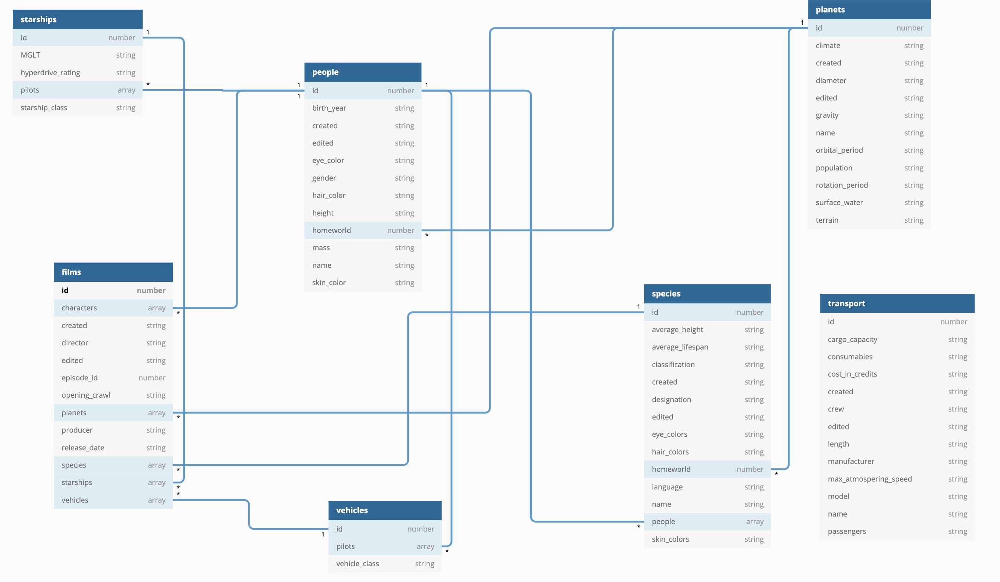

# Server

Starwars Application implemented for Prototype company task with NodeJS, ExpressJS, ReactJS, GraphQl, Apollo, JWT, REST, MongoDB.

## Requirements:

- ✅ Github
- ✅ Fully function
- ✅ ES6
- ✅ Readme
- ✅ ReactJS
- ✅ Responsive
- ⚠️ test
- ✅ Nodejs
- ✅ REST API
- ✅ GraphQL
- ✅ Git Branches
- ✅ Database Analysis
- ✅ Bouns: Authentication & Authorization
- ✅ Bouns: Heroku
- ✅ Bound: Linter (eslint)
- ⚠️ comment

## Server Setup

### prerequisites

- node
- npm
- clone repo

### environment variables

- create .env file
- add variables with:
  ```
  PORT=
  DB_URL=
  TOKEN_SECRET=
  REFRESH_SECRET=
  ```
- Note: to get random secret you can run this script in node `require("crypto").randomBytes(32).toString("hex");`

### start server

- run command `npm start`

### test server

- run command `npm test`

### test coverage

- run command `npm run coverage`

## Front-end setup

### prerequisites

- node
- npm
- clone repo

### environment variables

- modify constant variables in `src/constants.js`:
  ```
  export const BACKEND_URL =
  ```

### start server

- run command `npm start`

## Structure

### Backend

```
src
├── config.js // expose environment variables
├── controllers // contains controllers
│   ├── auth.controller.js
│   ├── task1.controller.js
│   ├── task2.controller.js
│   ├── task3.controller.js
│   └── task4.controller.js
├── index.js // entry point
├── models // useless models can be removed
│   ├── films.js
│   ├── index.js
│   ├── people.js
│   ├── planets.js
│   ├── species.js
│   ├── starships.js
│   ├── transports.js
│   └── vehicles.js
├── routes // routes for REST API
│   └── auth.js
├── schemas // GraphQl Schema
│   ├── index.js
│   ├── task1.js
│   ├── task2.js
│   ├── task3.js
│   └── task4.js
└── utils.js // REST API Utils
```

- Authentication: REST API
- Tasks: GraphQL

## API

| #   | API      | Description             | Method | Params                   | header      |
| --- | -------- | ----------------------- | ------ | ------------------------ | ----------- |
| 1   | /login   | to Sign in              | POST   | email, password          | N/A         |
| 2   | /signup  | to Sign up new user     | POST   | email,password,cpassword | N/A         |
| 3   | /token   | to Refresh Access Token | GET    | refreshToken             | N/A         |
| 4   | /graphql | GraphQl Endpoint        | ALL    | --                       | accessToken |

## GraphQL Schema

| #   | Name                  | Type  | Return Type                                                                    | Params | header      |
| --- | --------------------- | ----- | ------------------------------------------------------------------------------ | ------ | ----------- |
| 1   | longestOpeningCredits | Query | String                                                                         | N/A    | accessToken |
| 2   | MostAppearedCharacter | Query | String                                                                         | N/A    | accessToken |
| 3   | MostAppearedSpecies   | Query | [{name , value: {total: String, people: [ String ] }]                          | N/A    | accessToken |
| 4   | MostPlanetHasPilots   | Query | [{name , value: {total: String, people: [ { name: String, species: String ] }] | N/A    | accessToken |

## Database



- Foreign Key name (e.g. homeworld -> planetID)
- redunant of relations (films -> species , films -> people and species -> people)
